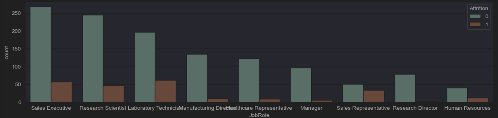
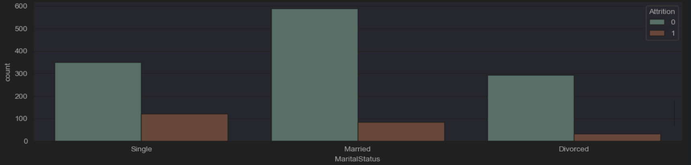
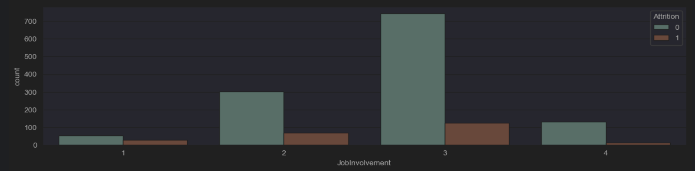
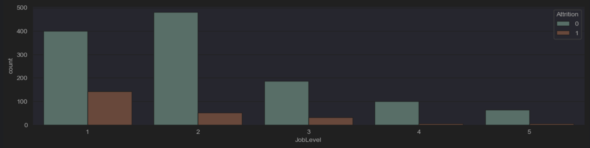
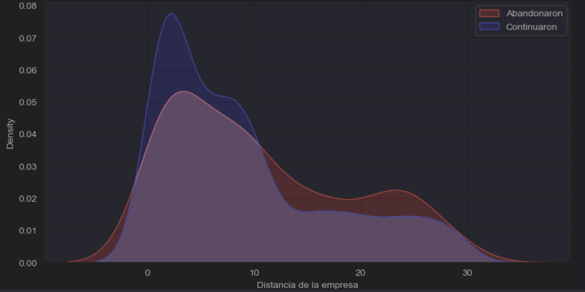
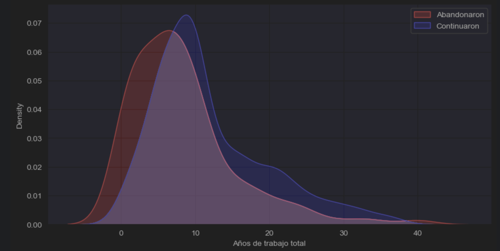
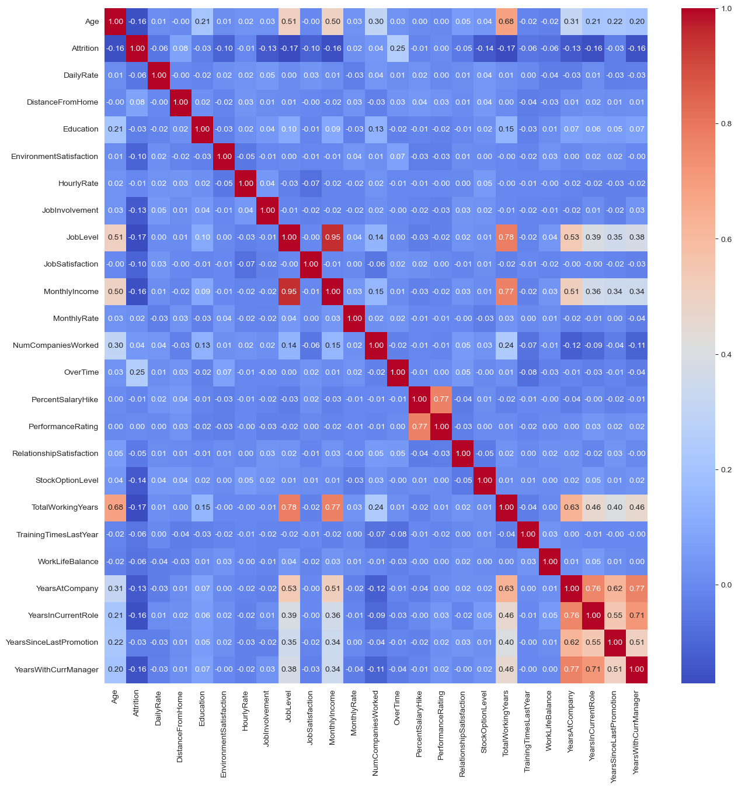

# Predicción de Abandono de Empleados (Employee Attrition Prediction)

## Descripción General

Este proyecto aborda la problemática de la rotación de personal mediante la construcción de un modelo predictivo. Utilizando datos históricos de empleados, el objetivo es identificar aquellos con alta probabilidad de abandonar la empresa, permitiendo a los departamentos de Recursos Humanos implementar estrategias de retención dirigidas. La rotación de personal genera costos significativos en México, lo que subraya la importancia de predecir y reducir el abandono.

## Dataset

El análisis se realiza sobre el dataset [IBM HR Analytics Employee Attrition & Performance](https://www.kaggle.com/datasets/pavansubhasht/ibm-hr-analytics-attrition-dataset) disponible en Kaggle. Este conjunto de datos incluye una variedad de atributos de empleados, como desempeño, satisfacción laboral, historial de trabajo y datos demográficos, junto con una variable indicadora de abandono (`Attrition`).

## Metodología

El proyecto sigue un flujo de trabajo estándar:

1.  **Carga y Exploración de Datos (EDA):** Análisis inicial para comprender la estructura de los datos, identificar valores faltantes y explorar la distribución de las variables, prestando especial atención al desbalance de clases en la variable objetivo.
2.  **Análisis Visual y de Correlación:** Visualización de relaciones entre variables clave y la tasa de abandono, así como el cálculo y visualización de la matriz de correlación para identificar patrones.
3.  **Preprocesamiento de Datos:** Preparación de los datos para el modelado, incluyendo:
    * Codificación de variables categóricas (Label Encoding y One-Hot Encoding).
    * Eliminación de columnas irrelevantes.
    * Escalado de características numéricas (MinMaxScaler).
4.  **Modelado:** Construcción y entrenamiento de un modelo de Regresión Logística.
5.  **Evaluación:** Evaluación del rendimiento del modelo utilizando métricas como Accuracy, Matriz de Confusión y Reporte de Clasificación (Precision, Recall, F1-score), considerando el impacto del desbalance de clases.

## Hallazgos Clave del EDA

* Se identificaron ciertas categorías de `JobRole` (ej. Sales Representative), `MaritalStatus` (Soltero), bajo `JobInvolvement` y bajos niveles de `JobLevel` como factores asociados a una mayor tasa de abandono.
* Variables como la `DistanceFromHome` y `YearsWithCurrManager` también mostraron distribuciones distintas entre los empleados que abandonaron y los que no.

**Distribución de Abandono por Variables Categóricas Clave:**

**Distribución de Variables Numéricas Clave vs. Abandono:**

**Matriz de Correlación de Variables Numéricas:**

## Resultados del Modelo

El modelo de Regresión Logística alcanzó una precisión general del 90%. Sin embargo, debido al marcado desbalance en las clases del dataset, la capacidad del modelo para identificar correctamente los casos positivos (empleados que abandonan) fue limitada, como se refleja en un bajo valor de `recall` (0.40) para la clase de abandono.

## Conclusiones y Próximos Pasos

El proyecto demuestra la aplicabilidad de un modelo predictivo para la detección temprana de la probabilidad de abandono de empleados. Los resultados iniciales, si bien prometedores en términos de precisión general, destacan la necesidad de abordar el desbalance de clases para mejorar la capacidad del modelo en la identificación de empleados en riesgo.

Como próximos pasos, se planea explorar técnicas avanzadas para manejar el desbalance de clases, experimentar con otros algoritmos de clasificación y posiblemente refinar la ingeniería o selección de características para mejorar el rendimiento predictivo, particularmente el `recall` de la clase minoritaria.

---
